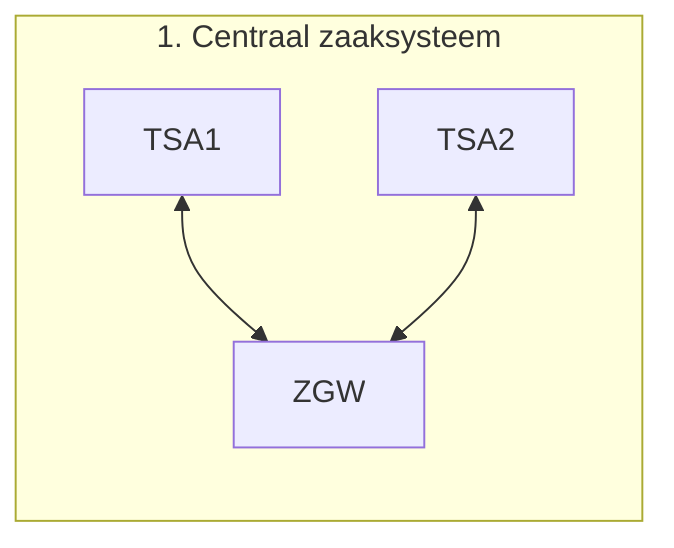
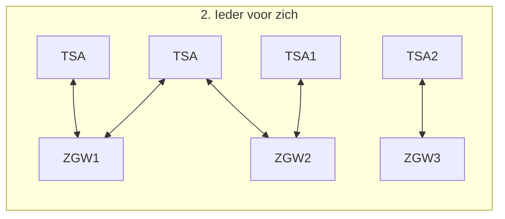
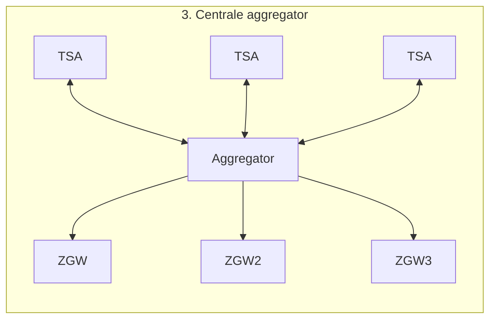
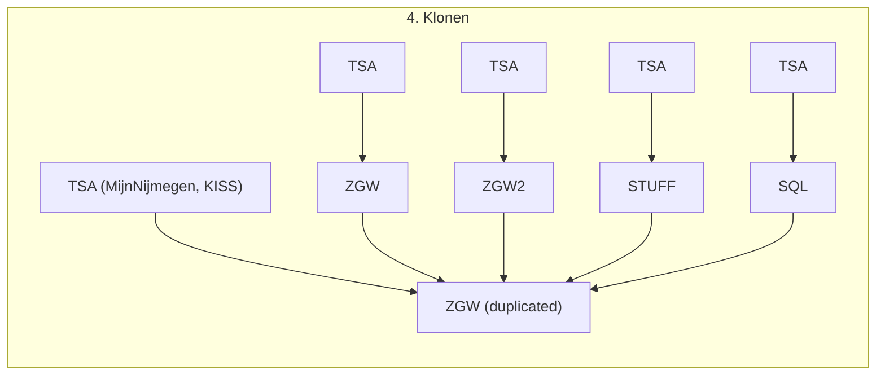

# Zaakgericht Werken (ZGW) architectuur opties
We hebben in de eerste architectuur sessie 4 opties voor het gebruiken van ZGW APIs in de organisatie gevonden.

## 1. Centraal (een zaaksysteem)

### Opmerkingen
- Werkt misschien als utopie, realistisch gezien zal je altijd in een van de andere sitauties terechtkomen in de transiatie hiernaartoe.
- Voorkeur van aantal grote gemeenten (of sommige kleinen) - Er zijn mensen die dit een goed idee vinden die een lepel in de pap hebben.
- 10 jaren plan.

## 2. Elke TSA bepaald zelf

### Opmerkingen
- Hoe omsluiten we dit naar een beeld?

## 3. Centrale aggregatie

### Opmerkingen
- Hoe gaan we om met aanmaken?

## 4. Duplicatie van data (een lees instantie)
