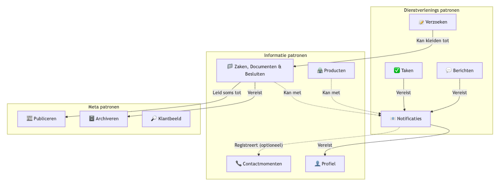

# Relaties tussen patronen

We onderschijden een aantal patronen als we de mijn-services architectuur volgen.
Deze patronen hebben echter afhankelijkheden dit kan functioneel of technisch zijn als de bestaande common ground componenten worden gebruikt.

Hieronder een overzicht van patronen die we tot nu toe zijn tegegekomen. Daaronder een duiding.

### Taken, berichten, Notificaties

**Van:** Taken & berichten

**Naar:** Notificaties

**Relatie:** vereist

**Toelichting:** Als een taak wordt uitgezet of een bericht in het mijn-portaal wordt klaargezet zal er een notificatie naar de inwoner gestuurd moeten worden.

### Notificaties en profiel

**Van:** Notificaties

**Naar:** Profiel

**Relatie:** vereist

**Toelichting:** Om een notificatie te sturen zijn de contactgegevens nodig. Die worden opgeslagen dmv het profiel patroon.

### Contactmomenten en Notificaties

**Van:** Notificaties

**Naar:** Contactmomenten

**Relatie:** Optioneel

**Toelichting:** Bij het versturen van een notificatie kunnen we een contactmoment vastleggen.

### Zaken, Documenten en Besluiten met Notificaties 

**Van:** Zaken, Documenten en Besluiten

**Naar:** Notificaties

**Relatie:** Kan met

**Toelichting:** Het is mogelijk van zaak/besluite informatie notificaties naar de inwoner te sturen.

### Zaken, Documenten en Besluiten met Archiveren 

**Van:** Zaken, Documenten en Besluiten

**Naar:** Archiveren

**Relatie:** Vereist

**Toelichting:** Het is nodig de informatie over zaken, besluiten en de bijbehorende documenten te archiveren.

### Zaken, Documenten en Besluiten met Publiceren 

**Van:** Zaken, Documenten en Besluiten

**Naar:** Publiceren

**Relatie:** Vereist

**Toelichting:** Het is soms nodig de informatie over zaken, besluiten en de bijbehorende documenten te publiceren. (Niet altijd, maar soms is dit verplicht vandaar een verplichte relatie).

### Klantbeeld (relaties niet in diagram)

**Van:** Zaken, Documenten en Besluiten, Contactmomenten, Profiel, Taken, Berichten, Producten

**Naar:** Klantbeeld

**Relatie:** Vereist

**Toelichting:** Het klantbeeld is een samenstelling van data uit alle patronen, afhankelijk van wie de vraag stelt, zal het beeld er anders uit zien.