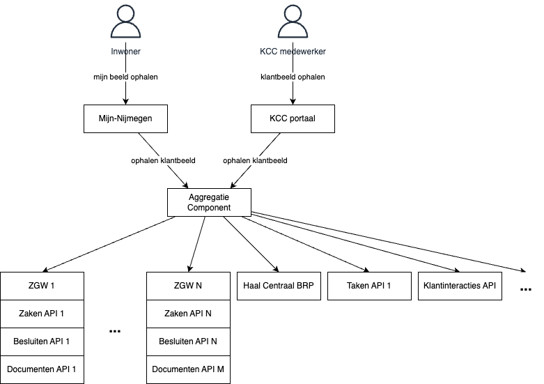

# Patroon: Taken

**Mijn-Services naam:** geen Mijn-Services patroon maar een meta patroon

Het klantbeeld patroon bestaat uit een sub-patroon:
- Opahelen klantbeeld

**Richtlijnen:**
- ??? (Zijn er richtlijnen voor het implementeren van dit patroon?)

## Ophalen klantbeeld

**Doel:**
- De bevrager kan een beel krijgen van een klant (inwoner of bedrijf)
- De bevrager kan bijvoorbeeld zijn: consulent, KCC medewerker, de inwoner zelf
- Het beeld wordt aangepast naar de rol van de bevrager

**Hoe:**
- Doormiddel van een aggregatie component dat het beeld samenstelt uit verschillende bronnen. 

**Plaat:**

