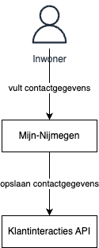
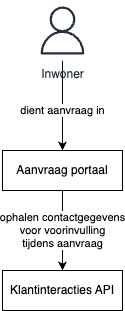

# Patroon: Profiel

**Mijn-Services naam:** Mijn-Profile

Het profiel patroon bestaat uit 2 patronen:
- Contactgegevens beheren
- Contactgegevens voorinvullen

**Links:**
- [Webinar Mijn-Profiel](https://www.youtube.com/watch?v=4dWU6Z0F-5A)

**Richtlijnen:**
- Centraal uitvoeren om versnippering van contactgegevens en voorkeuren tegen te gaan.

## Contactgegevens beheren

**Doel:**
- De inwoner kan zijn contactgegevens (incl. contactvoorkeuren) met de Gemeente Nijmegen beheren 

**Hoe:**
- De Klantinteracties API geeft mogelijkheden om contactgegevens van inwoners (en bedrijven) op te slaan.

**Plaat:**

## Contactgegevens voorinvullen

**Doel:**
- De inwoner krijgt zijn contactgegevens vooringevuld bij het doen van een aanvraag.

**Hoe:**
- De Klantinteracties API geeft mogelijkheden om contactgegevens van inwoners (en bedrijven) op te slaan.

**Plaat:**

