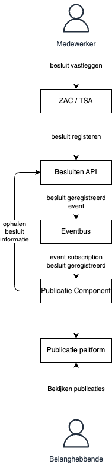

# Meta patroon: Publiceren

**Mijn-Services naam:** Dit is geen Mijn-Services, maar een meta patroon

**Links:**
- 

Het publiceren patroon bestaat uit 1 patronen:
- Besluiten publiceren

**Richtlijnen:**
- ??? (Zijn er richtlijnen voor het implementeren van dit patroon?)

## Besluiten publiceren

**Doel:**
- Besluiten worden gepubliceerd op de juiste kanalen voor alle belanghebbende.

**Hoe:**
- De Besluiten API geeft notificaties. 
- Een publicatie component pakt dit op en publiceert dit

**Plaat:**

