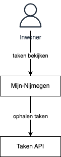
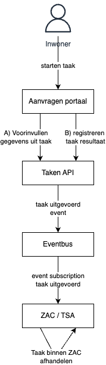
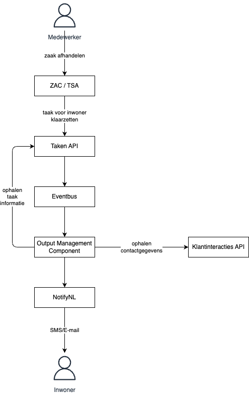

# Patroon: Taken

**Mijn-Services naam:** Mijn-Taken

**Links:**
- [Taken patroon op Platform Generieke Dienstverlening](https://dienstverleningsplatform.gitbook.io/platform-generieke-dienstverlening-public/patronen/taken/externe-klanttaak)
(Let op: in deze documentatie wordt gebruik gemaakt van de Objecten API als Taken API. Inmiddels is de Taken API bijna gereleased.)
- [Webinar Mijn-Taken](https://www.youtube.com/watch?v=RTJTIU-FLfk&feature=youtu.be)

Het taken patroon bestaat uit 3 patronen:
- Taken inzien
- Taak uitvoeren
- Taak klaarzetten voor inwoner

**Richtlijnen:**
- ??? (Zijn er richtlijnen voor het implementeren van dit patroon?)

## Taken inzien

**Doel:**
- De inwoner kan een overzicht van zijn openstaande taken zien op Mijn-Nijmegen

**Hoe:**
- Het Mijn-Nijmegen haalt de taken op uit de Taken API

**Plaat:**

## Taken uitvoeren

**Doel:**
- De inwoner kan een taak uitvoeren
- De resultaten van de taak komen terug in het process

**Hoe:**
- Het aanvraagportaal geeft de inwoner de mogelijkheid de taak uit te voeren.
- Events van het afronden van de taak worden door het ZAC/TSA opgepakt. 

**Plaat:**

## Taken klaarzetten voor inwoner

**Doel:**
- De medewerker kan een taak klaarzetten voor een inwonwer
- De inwoner ontvangt een notificatie dat er een taak klaar staat

**Hoe:**
- De Taken API maakt het mogelijk om taken te registreren
- NotifyNL + OMC maken het mogelijk om dmv events een inwoner notificatie te sturen

**Plaat:**

