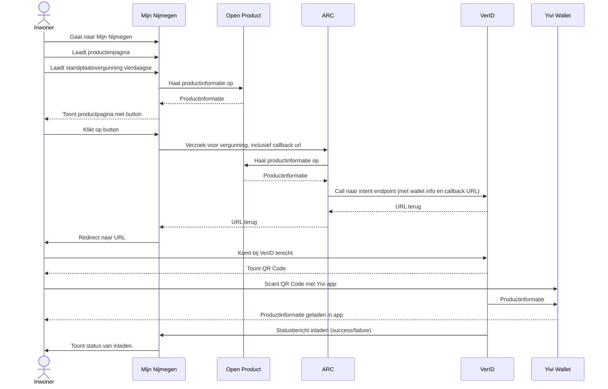

# Flow voor laden productinformatie in Wallet
Deze flow neemt aan dat al een product bestaat in Open producten.

```mermaid
sequenceDiagram
    actor Inwoner
    participant MN as Mijn Nijmegen
    participant OP as Open Product
    participant ARC
    participant VerID
    participant Yivi as Yivi Wallet

    Inwoner->>MN: Gaat naar Mijn Nijmegen
    Inwoner->>MN: Laadt productenpagina
    Inwoner->>MN: Laadt standplaatsvergunning vierdaagse
    MN->>OP: Haal productinformatie op
    OP-->>MN: Productinformatie
    MN-->>Inwoner: Toont productpagina met button
    
    Inwoner->>MN: Klikt op button
    MN->>ARC: Verzoek voor vergunning, inclusief callback url
    ARC->>OP: Haal productinformatie op
    OP-->>ARC: Productinformatie
    ARC->>VerID: Call naar intent endpoint (met wallet info en callback URL)
    VerID-->>ARC: URL terug
    ARC-->>MN: URL terug
    
    MN->>Inwoner: Redirect naar URL
    Inwoner->>VerID: Komt bij VerID terecht
    VerID-->>Inwoner: Toont QR Code
    Inwoner->>Yivi: Scant QR Code met Yivi app
    VerID->>Yivi: Productinformatie
    Yivi-->>Inwoner: Productinformatie geladen in app
    VerID->>MN: Statusbericht inladen (success/failure)
    MN->>Inwoner: Toont status van inladen.
```
