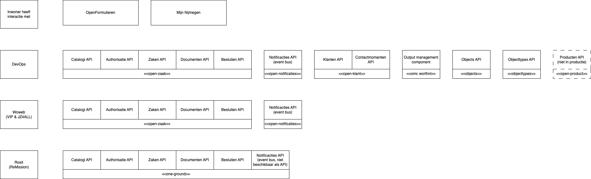

# Brainstormsessie MijnServices

Waar willen we heen met mijn services en kunnen we een roadmap maken?

## Waar staan we nu?
  - Veel kennis en netwerk op het gebied van mijn-services bij DevOps.
  - Stabiele onderlaag in productie met mijn-services componenten.

**Overzicht huidige componenten in productie:** De kaart hieronder geeft weer welke APIs we beschikbaar hebben binnen onze organisatie. Een groot deel leeft bij DevOps en een deel bij leveranciers: Woweb en Roxit.

## Relatie met andere ontwikkelingen in de organisatie
Er komen verschillende visies/projecten aan:
- Digitaal Nijmegen
- Visie op dienstverlening
- Project informatiehuishouding

Is het mogelijk om vanuit de technische expertise en detail kennis die in het DevOps team zit hier op in te spelen?

## Uitdagingen

Persoonlijk: we hebben een fundament, ik mis nu een stip op de horizon.
  - Wat gaan we doen om dit verder uit te rollen?
  - Welke smaken zijn er bij het uitrollen van ZGW?
  - Willen we dit wel, of willen we op bepaalde componenten iets anders doen?

## Een aantal patronen/vraagstukken

### Takenpatroon
- Ingezet voor ESF (niet helemaal conform standaard), voor hoever er een standaard is.
  - Niet ZGW notificatie route
 
- Ingezet voor APV domein.
  - Medewerkers starten een taak voor inwoners

Vragen:
- Willen we dit breder uitrollen meer gebruiken?

### Contactgegevens beheren
- Integratie tussen open-klant en mijn-nijmegen
- Integratie met open-formulieren

- Hoe om te gaan met andere portalen en prefill van informatie?
- Ideaal voor het versturen van notificaties.

### Inzet van MijnServices APIs 

Er bestaat zoiets als een verzoek in ZGW. Hiervoor wordt binnenkort een component ontwikkeld om dit patroon te bestendigen. [Zie hier voor de documentatie rondom dit issue](https://dienstverleningsplatform.gitbook.io/platform-generieke-dienstverlening-public/patronen/verzoeken). 

**Smaak 1:** Een schaduwadministratie met zaak en status informatie die wordt bijgewerkt vanuit niet ZGW systemen.
Ofwel, als je de inwoner wil informeren over status van een aanvraag/zaak zorg dat je informatie in het ZGW zaaksysteem land.
- Haken en ogen wat betreft taken/interactie patronen.

**Smaak 2:** Gebruik ZGW als onderlaag in een TSA (zoals bijvoorbeeld VIP en JZ4ALL).
- Applicatie specifieke laag nodig voor inhoudelijke informatie, maar zaakmetadata is te benaderen en AAN TE PASSEN via ZGW APIs.

Vragen:
- Wat is wenselijk, waar streven we naar? (Informeren van de inwoner over producten/zaken? )
- Hoe kijken we hier naar met het TBV component in het achterhoofd?

### Hoe omgaan met identificatie van bedrijven?
- We gebruiken nu KVK als identificatie, net als een BSN een persoon identificeert.
- Een bedrijf heeft vaak contactpersonen, hoe moeten we hier mee omgaan in ons landschap.

### Archivering van zaakinformatie
Afhanklijk van welke smaak(en) er worden ingezet is archief vernietiging ook relevant.
Er is ook een [open-archiefbeheer tool](https://dienstverleningsplatform.gitbook.io/platform-generieke-dienstverlening-public/onderzoeken/archiveren/open-archiefbeheer) waarin verwijdering van oude zaken geregeld is.

### Hoe om te gaan met meerdere portalen?
Moet onze focus niet meer liggen op het comfortable/duidelijk maken voor de inwoner hoe om te gaan met de portalen.
Hoe verhoud zich dit tot de nieuwe visies die er aankomen? Gaan we voor een portaal of moeten wij accepteren dat dat niet gebeurt? En waar moeten we dan als DevOps team juist de focus leggen?
- Denk onder andere aan SSO

### Is MijnServices ZGW waar we nu de focus moeten hebben?
- Is de organisatie klaar?

### Wat is onze notify.nl stratie?
- OMC of direct?

### Printstraat aanspreken en notificeren vs brieven
- Wie houd bij welke inwoners berichtenbox aan hebben staan?
- OMC heeft BRP haal centraal fallback (vgm)

