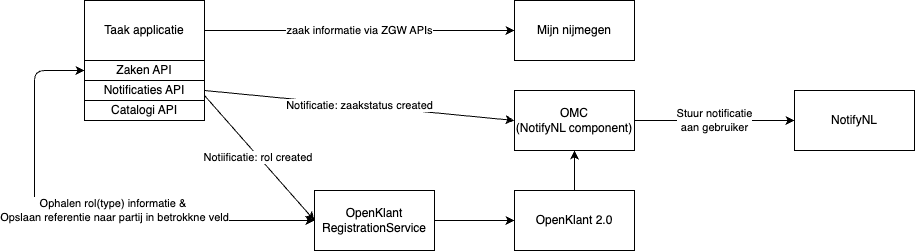

# OpenKlantRegistrationService

Deze service registreert klant gegevens in open klant obv ZGW APIs en notificaties. We doen dit met het doel om het OMC te kunnen gebruiken en zo notificaties van zaak statusen (create, update, afgerond) en taken te kunnen sturen via NotifyNL.

Dit geeft de volgende componenten:

## Domain
Een klein stukje overzicht van het domein en de objecten die daarin zitten.

Note: zie ook https://github.com/maykinmedia/open-klant/issues/227

## Implementatie details

- De service is geimpmeenteerd in een lambda en wordt achter de API gateway van dit project gedeployed.
- Een nieuwe configuratie toevoegen gaat door het toevoegen van een nieuwe configuratie `OpenKlantRegistrationServiceConfiguration` in de [configuratie file](../../Configuration.ts).
- Er zijn verschillende strategien te configureren die gebruikt worden, dit gebeurt via een environment variabele: `STRATEGY`
- Elke deployment van de regisratie service heeft eigen secrets [zie hier](./OpenKlantRegistrationService.ts#55)

## Testen
Ik gebruik de test file [createTestZaak.test.ts](./Listener/test/createTestZaak.test.ts) om handmatig zaken (met rol en status) aan te maken. De notificatie gaat dan naar de VulService (en het OMC).

Er zijn momenteel 3 vul service instanties uitgerold op accp.
- VrijBRP
- Woweb
- Development (maakt gebruik van onze sandbox ZGW dingen)

## Roadmap
Er spelen een aantal problemen rond de registratie service zoals deze in de notificatie flow is ingetekend.
- Timing - Status aangemaakt voor rol toegekend, hierop default het OMC naar zoeken op BSN.
- eHerkenning - We weten de naam van de contactpersoon nooit (deze is zelf ingevuld) dus we kunnen een partij niet goed identificeren.
- Meerdere zaken - Wat gebeurt er in het geval dat een zaak is ingeschoten en na een week dezlefe persoon nog een zaak inschiet?

We gaan eerst voor een tijdelijke oplossing om het takenpatroon in VIP aan de praat te krijgen.

### Fase 1 - RegisratieService werkend voor Taken patroon VIP (huidige situatie)
- Elke zaak (met initiator rol) krijgt een unieke partij in OpenKlant met de contactgegevens die opgegeven zijn bij het starten van die zaak.

De problemen worden dan op de volgende manier verholpen/omzeild:
- Timing - Wanner er nog geen partij aan een rol hangt valt het OMC terug op zoeken op BSN. Omdat er geen partijen met BSN geregistreerd zijn faalt het OMC. De notificatie API stuurt de notificatie dan nog een keer (retry), tegen die tijd bestaat referentie naar de partij in de rol wel.
- eHereknning - We identificeren gebruikers nog niet, er ligt een directe relatie tussen een initiator rol (uniek voor elke zaak) en de partij in OpenKlant.
- Meerder zaken - Omdat we een partij per zaak gebruiken updaten we geen contactgegevens.

**LET OP:** We moeten nog valideren of een TAAK notificatie in het OMC ook het betrokkene veld van de initiator rol gebruikt of alsnog een query op BSN doet!

Opruimen: We kunnen de fase 1 situatie opruimen door gebruik te maken van het nep ID dat elke partij krijgt. We geven een partij aangemaatk in deze fase namelijk het `codeRegister: 'TEMP'` veld in de partijIdentificatie mee. We kunnen uiteindelijk al deze partijen verwijderen.

## Fase 2 - Ideale situatie
Deze problemen worden uitendelijk opgelost wanner we de volgende opzet kunnen gaan gebruiken:
- In mijn-nijmegen kan een partij zijn contactgegevens inzien en aanpassen
- In de formulieren oplossing worden contactgegevens geprefilled en kunnen worden aangepast
- De regisratie service kijkt na een formulier submission of de partij en OpenKlant geupdate moet worden
- Bij gebruik eHerkenning maken we gebruik van het PseudoID om de partij te identificeren (dit vereist ook een aanpassing van Woweb als we dit mee sturen in het formulier)
- Om de prefill en PseudoID voor elkaar te krijgen kunnen we gebruik maken van features in OpenForms

De problemen worden dan op de volgende manier verholpen:
- Timing - Een referentie van de rol naar de partij kan nog niet bestaan. Zoeken op BSN levert dan mogelijk oude contactgegevens op als de regisratie service nog geen update heeft kunnen doen nav. de formulier inzending.
- eHereknning - We maken gebruik van het PseudoID om contactpersoonen van een organisatie te herkennen.
- Meerder zaken - Een Klant komt maar een keer voor en kan zijn contactgegvens centraal updaten en valdieren (obv prefill) in het formulier. Het aanpassen van je contactgevens (globaal) heeft dus een globaal effect.
