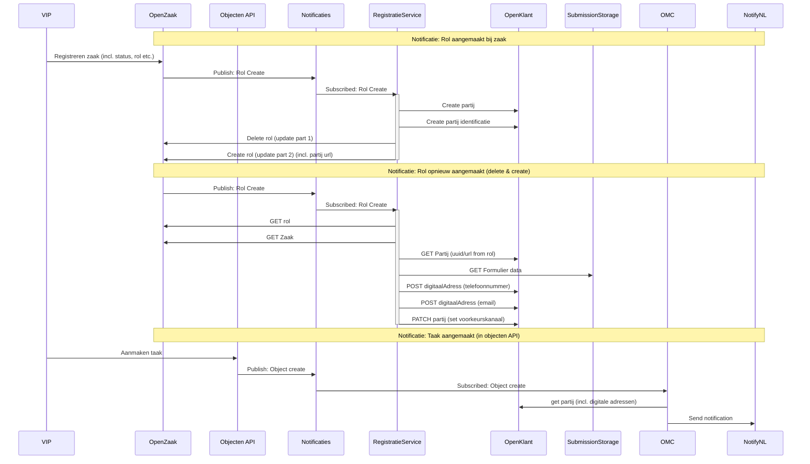

# Strategy: Partij per zaak using form data

Gist: registration service wordt 2 keer getriggered door het verwijderen en opnieuw aanmaken van de rol. De 1e keer wordt de partij aangemaakt de 2e keer wordt de bestaande partij gevuld met email/telefoon en voorkeur.

