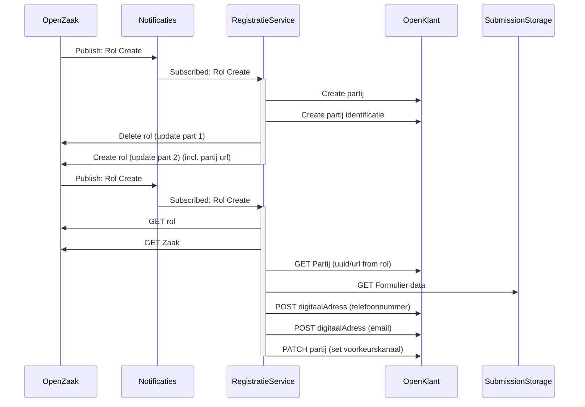

# Strategy: Partij per zaak using form data

```mermaid
sequenceDiagram
  participant OpenZaak
  participant Notificaties
  participant RegistratieService
  participant OpenKlant
  participant SubmissionStorage

  OpenZaak ->> Notificaties: Publish: Rol Create
  Notificaties ->> RegistratieService: Subscribed: Rol Create
  activate RegistratieService
  RegistratieService ->> OpenKlant: Create partij
  RegistratieService ->> OpenKlant: Create partij identificatie
  RegistratieService ->> OpenZaak: Delete rol (update part 1)
  RegistratieService ->> OpenZaak: Create rol (update part 2) (incl. partij url)
  deactivate RegistratieService

  OpenZaak ->> Notificaties: Publish: Rol Create
  Notificaties ->> RegistratieService: Subscribed: Rol Create
  activate RegistratieService
  RegistratieService ->> OpenZaak: GET rol
  RegistratieService ->> OpenZaak: GET Zaak
  RegistratieService ->> OpenKlant: GET Partij (uuid/url from rol)
  RegistratieService ->> SubmissionStorage: GET Formulier data
  RegistratieService ->> OpenKlant: POST digitaalAdress (telefoonnummer)
  RegistratieService ->> OpenKlant: POST digitaalAdress (email)
  RegistratieService ->> OpenKlant: PATCH partij (set voorkeurskanaal)
  deactivate RegistratieService
```